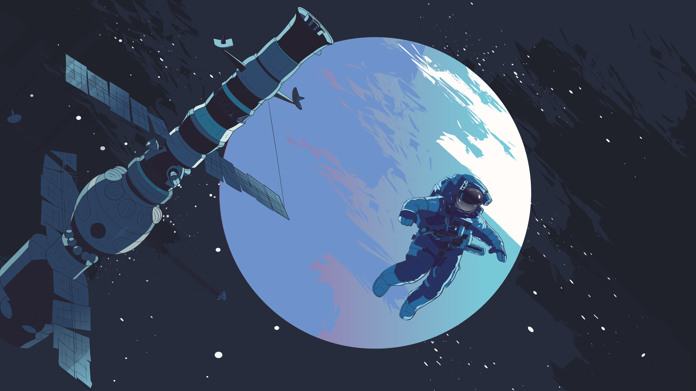
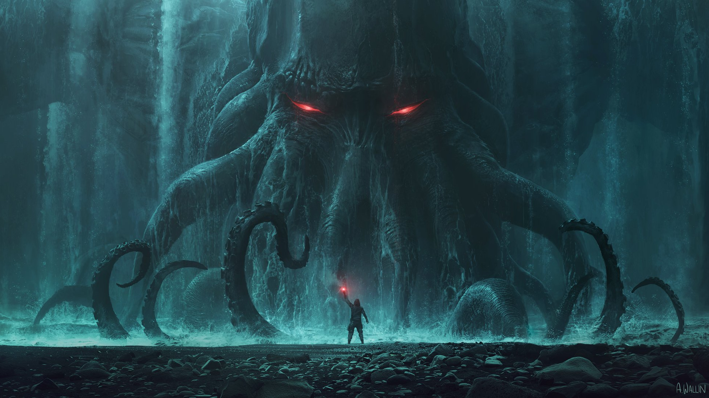
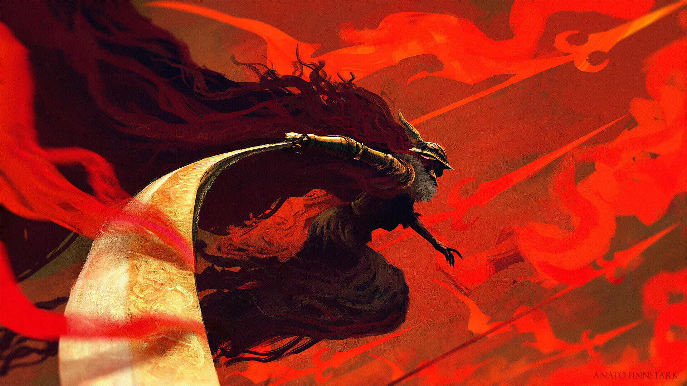
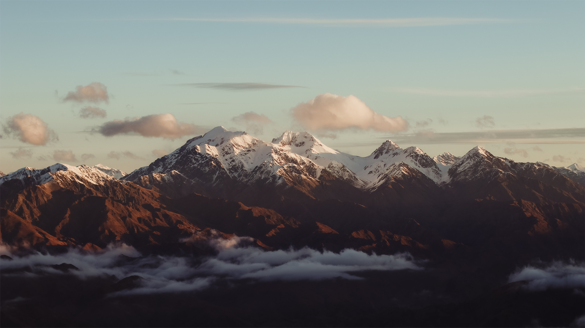
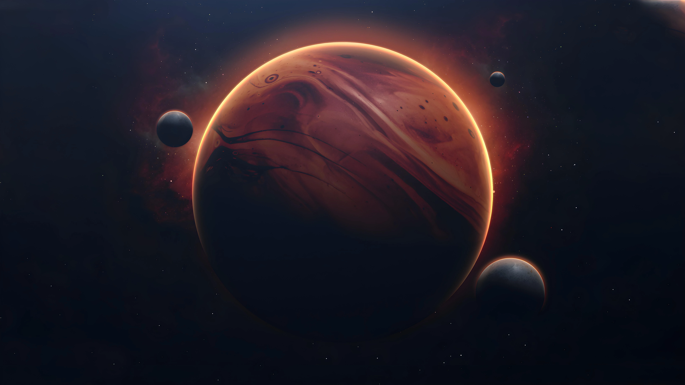

# Wallpapers
My Collection of PC Wallpapers.

It mostly consists of digital art. I update it weekly.

# Want to get latest wallpapers from repository?
1. Download [git](https://git-scm.com/) on your system
2. Run the following command in your terminal

```shell
git clone https://github.com/Ishgar14/Wallpapers.git
```
This will download all the wallpapers in current working directory

---

To keep updating your wallpapers run
```shell
git pull origin main
```

# Source
Most of the wallpapers I got are from [r/wallpaper](https://www.reddit.com/r/wallpaper/) and [r/wallpapers](https://www.reddit.com/r/wallpapers)

# Sample Images















