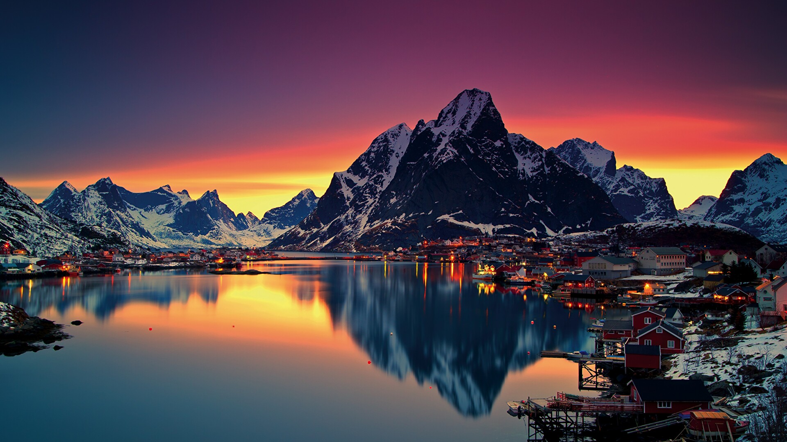
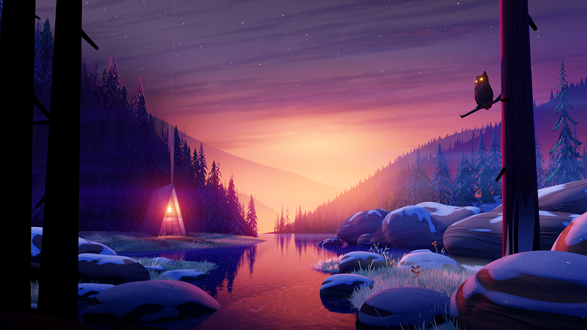

# Wallpapers
My Collection of PC Wallpapers. 

It mostly consists of digital art.

# Source
Most of the wallpapers I got are from [r/wallpaper](https://www.reddit.com/r/wallpaper/) and [r/wallpapers](https://www.reddit.com/r/wallpapers)

# Sample Images

